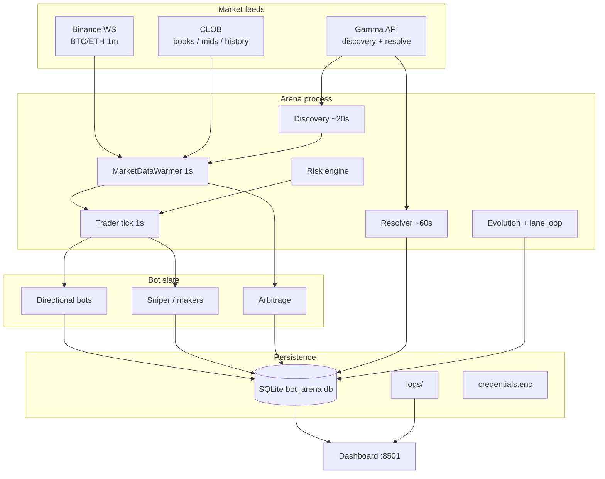
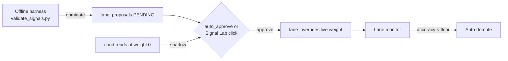

# Polymarket Bot Arena

Competing trading bots on **Polymarket BTC 5-minute Up/Down** markets.

- **Paper mode** — full simulation against *real* CLOB order books (depth-walked fills, taker fees, real resolutions). No API keys.
- **Live mode** — same decision path, real CLOB orders (credentials required).
- **Evolution** — multi-objective genetic algorithm ranks directional bots every few hours and replaces losers with crossover/mutation offspring of elites.
- **Signal Lab** — candidate lanes must clear offline net-edge *and* live shadow attribution before carrying weight.

> Deep strategy notes → [`strategy.md`](./strategy.md)  
> Developer internals / bug history → [`CLAUDE.md`](./CLAUDE.md) · [`BUG_HISTORY.md`](./BUG_HISTORY.md)  
> Docker 24/7 → [`docs/docker.md`](./docs/docker.md)  
> Backtests → [`docs/backtesting.md`](./docs/backtesting.md)  
> Signal suite → [`docs/signal-suite.md`](./docs/signal-suite.md)

---

## Table of contents

1. [Quickstart](#quickstart)
2. [Architecture](#architecture)
3. [Default bot slate](#default-bot-slate)
4. [How decisions work](#how-decisions-work)
5. [Evolution & regimes](#evolution--regimes)
6. [Signal validation](#signal-validation)
7. [Risk controls](#risk-controls)
8. [Backtesting](#backtesting)
9. [Setup & run](#setup--run)
10. [Path to live trading](#path-to-live-trading)
11. [Dashboard & ops](#dashboard--ops)
12. [Telegram alerts & commands](#telegram-alerts--commands)

---

## Quickstart

Paper trading needs **no API keys**. You need **Python 3.10+**, outbound HTTPS
(Polymarket + Binance), and either a project venv **or** Docker.

| Goal | Fastest path |
|------|----------------|
| Try it now (any OS with Docker) | [Docker one-liner](#docker-any-os) |
| Dev / interactive bot menu | [Native install](#native-install-macos--linux--windows) below for your OS |
| Unattended 24/7 | Docker (all OS) · launchd (macOS) · systemd (Linux) — see [Setup & run](#setup--run) |

### Docker (any OS)

Works the same on **macOS, Windows (Docker Desktop), and Linux**.

```bash
# Prerequisites: Docker Engine + Compose v2
#   macOS/Windows: https://docs.docker.com/desktop/
#   Linux:         https://docs.docker.com/engine/install/

git clone https://github.com/senseirandystl/polymarket-bot-arena.git
cd polymarket-bot-arena

cp .env.example .env
# Optional but recommended: set DASHBOARD_PASS in .env before any network expose

docker compose up -d --build
# Dashboard → http://127.0.0.1:8501  (default login admin / Thor unless you changed .env)
docker compose logs -f arena
```

Stop: `docker compose down` (keeps `./data`). Full VPS guide: [`docs/docker.md`](./docs/docker.md).

### Native install (macOS / Linux / Windows)

#### 1. Clone

```bash
git clone https://github.com/senseirandystl/polymarket-bot-arena.git
cd polymarket-bot-arena
```

On Windows, use **PowerShell**, **cmd**, **Git Bash**, or **WSL2**. Paths below use
`python3` on Unix-like shells; Windows native Python is usually `py` or `python`.

#### 2. Create the venv and install deps

<details open>
<summary><strong>macOS / Linux</strong></summary>

```bash
python3 -m venv .venv
.venv/bin/pip install --upgrade pip
.venv/bin/pip install -r requirements.txt
```

If `python3` is missing: install from [python.org](https://www.python.org/downloads/)
or your package manager (`brew install python`, `sudo apt install python3 python3-venv python3-pip`, etc.).

</details>

<details open>
<summary><strong>Windows (PowerShell)</strong></summary>

```powershell
# Prefer the Python launcher if installed
py -3 -m venv .venv
.\.venv\Scripts\python.exe -m pip install --upgrade pip
.\.venv\Scripts\pip.exe install -r requirements.txt
```

Use **Command Prompt** with the same paths if you prefer (`\.venv\Scripts\...`).
Always call the venv interpreter — system `python` will not have `cryptography`
and other deps.

</details>

<details>
<summary><strong>Windows (WSL2 / Git Bash)</strong></summary>

Use the **macOS / Linux** commands inside WSL or Git Bash. Prefer **WSL2** for
long-running paper sessions (file watching and networking behave more like Linux).

</details>

#### 3. Start paper trading

<details open>
<summary><strong>macOS / Linux</strong></summary>

```bash
# Recommended: wrapper pins venv, may auto-start the dashboard
./bin/arena

# Or explicit:
.venv/bin/python3 arena.py
# separate terminal if the dashboard is not already up:
.venv/bin/python3 dashboard/server.py
```

On first interactive run: **Continue** vs **Start fresh**, then **Default** bots
(Enter) or a manual selection (`1,3,5` / `1-6`).

</details>

<details open>
<summary><strong>Windows (PowerShell)</strong></summary>

`bin/arena` is a **bash** script — it does **not** run in PowerShell/cmd unless
you use Git Bash or WSL. On native Windows prefer the helper:

```powershell
# Arena only (sets ARENA_NO_DASHBOARD=1). Optional: -WithDashboard
.\bin\arena.ps1

# Or two terminals manually:
.\.venv\Scripts\python.exe dashboard\server.py
.\.venv\Scripts\python.exe arena.py
```

Or from **Git Bash / WSL** after a Unix-style venv install:

```bash
./bin/arena
```

</details>

#### 4. Open the dashboard

| | |
|--|--|
| URL | [http://127.0.0.1:8501](http://127.0.0.1:8501) |
| Default auth | user `admin` / password `Thor` |
| Override | env vars `DASHBOARD_USER` and `DASHBOARD_PASS` (all OS) |

```bash
# Health probe (no auth) — macOS/Linux/Git Bash/WSL
curl -s http://127.0.0.1:8501/healthz

# PowerShell
Invoke-RestMethod http://127.0.0.1:8501/healthz
```

### OS cheatsheet

| Task | macOS | Linux | Windows |
|------|-------|-------|---------|
| Python in venv | `.venv/bin/python3` | `.venv/bin/python3` | `.\.venv\Scripts\python.exe` |
| One-shot stack | `./bin/arena` | `./bin/arena` | Two terminals (above) or Docker / WSL |
| 24/7 native | launchd plists | `deploy/systemd/*.service` | Docker Desktop (recommended) |
| Path separators | `/` | `/` | `\` in PowerShell; `/` in Git Bash/WSL |
| Line endings | LF | LF | Use LF in git (`core.autocrlf` input) so shell scripts stay valid |
| Stop arena | `Ctrl-C` in the terminal | same | same; Docker: `docker compose down` |

### Smoke checks (optional)

```bash
# macOS / Linux
.venv/bin/python3 -m pytest -q
.venv/bin/python3 -m backtest --days 1

# Windows PowerShell
.\.venv\Scripts\python.exe -m pytest -q
.\.venv\Scripts\python.exe -m backtest --days 1
```

More detail: [Setup & run](#setup--run), [Backtesting](#backtesting), [Path to live trading](#path-to-live-trading).

---

## Architecture



### Runtime threads (arena)

| Loop | Cadence | Role |
|------|---------|------|
| Discovery | ~20s | Gamma series scan → current/next 5-min window |
| Market-data warmer | **1s** | Sole owner of per-market HTTPS (YES/NO books, OBI, CVD, PM mom) → in-memory store |
| Trader | **1s** | Zero network on the hot path; each bot `make_decision` → venue fill |
| Resolver | ~60s | Map closed markets → win/loss P&L |
| Position monitor | 0.5s | SL/TP exits where configured |
| Evolution host | 2h (+ triggers) | GA cycle, lane monitor/promoter, core-lane tuner, risk eval, validation scheduler |

### Repo map

```
arena.py                 # Boot, threads, evolution host
arena/                   # Trader, discovery, warmer, resolver, risk, lanes, health
bots/                    # BaseBot + one module per strategy (+ meta_learner)
evolution/               # GA fitness, operators, bounds
signals/                 # Drift/strike, regimes, orderflow, technicals, features
venues/                  # paper (book sim) / live (CLOB)
backtest/                # Offline replay of the real decision path
tools/validate_signals.py
dashboard/               # FastAPI + static UI (:8501)
deploy/systemd/          # Linux bare-metal units
docs/                    # docker, backtesting, signal-suite
```

Paper and live share **identical** pricing, fee, guard, and Kelly math. Only the venue engine differs (`venues/paper.py` vs `venues/live.py`).

---

## Default bot slate

Interactive launch (or first non-interactive boot) starts the **lean 7**:

| Bot | Type | Character |
|-----|------|-----------|
| `momentum-v1` | Directional | BTC short-term trend (mom-heavy blend) |
| `meanrev-v1` | Directional | Drift anchor + z-score fade (drift-gated) |
| `sniper-v1` | Lag | Drift-vs-price lag hunter |
| `hybrid-v1` | Ensemble | Regime-aware blend of mom / meanrev / phantom |
| `arbitrage-v1` | Market-neutral | Share-matched YES+NO when pair VWAP clears fees |
| `sweeper-v1` | Certainty | Locked outcomes still offered under $1 (fee-curve extreme) |

Also selectable (manual menu or dashboard **Deploy bots** mid-run): phantom,
late-window / fee-zone makers, lag-residual, regime-specialist, no-lag,
true-maker, meanrev-tp.  
**Evolution-exempt:** arbitrage, sweeper, makers (and copy-trade if enabled).

---

## How decisions work

Directional bots use a **model-blend fair value** (not “mid + bonuses”):

```
P_model = 0.5 + 0.5 · Σ (w_lane · lane)     # lanes in [-1, 1], YES frame
skip if |P_model − 0.5| < MODEL_LEAN_MIN     # no opinion → no trade
trust_eff = trust · min(1, lean / CONVICTION_SCALE)
edge_side = trust_eff · (P_side − ask_side) − taker_fee
```

- **Live core lanes:** `drift` (BTC **TWAP** vs window-open TWAP strike, 60s lookback for 5m markets — `TWAP_WINDOW_SEC`), `mom` (1-candle spot), `strat` (`analyze()` thesis, magnitude-capped).
- **Kill-switched / candidates:** `pm`, `cvd`, `obi`, `fut`, `tech`, `xasset` — logged as `cand(...)` for shadow attribution; weight stays 0 until promoted.
- **Two-sided:** each side scored on its own ask + fee; buy the larger positive edge above per-strategy `MIN_EDGE`.
- **Sizing:** fractional Kelly `f* = edge/(1−price)`, bet = `KELLY_FRACTION × f* × bankroll` (paper pool shared; live hard-capped).

Hard safety gates (symmetric YES/NO): consensus floor, high-price ceiling, book-sum consistency, drift veto, dead-zone (coin-flip mid + flat drift), session skips, clean-tick, exposure cap. Details in [`strategy.md`](./strategy.md) and [`CLAUDE.md`](./CLAUDE.md).

---

## Evolution & regimes

### Genetic algorithm (roster)

Every `EVOLUTION_INTERVAL_HOURS` (2h), or earlier on a performance trigger, the GA:

1. Scores each directional bot on a **24h** window with multi-objective fitness: P&L, Sharpe-like, drawdown, consistency, **regime robustness**.
2. Protects **elites** (`GA_ELITE_COUNT`).
3. Replaces underperformers (need ≥ `MIN_TRADES_FOR_JUDGMENT` resolved trades; survival also considers break-even gap `WR − avg_entry`).
4. Builds offspring via **tournament selection → crossover → Gaussian mutation** near proven params (not a full re-roll).

Lane *weights* are **not** evolved — the **core-lane tuner** nudges drift/mom/strat per strategy type from live attribution. Evolution owns the roster; the tuner owns the blend.

### Market regimes (context)

`signals/regime_detector.py` classifies tape continuously (not only at resolve):

| Regime | Meaning |
|--------|---------|
| `high_vol_trend` | Violent, directional |
| `low_vol_trend` | Quiet grind |
| `high_vol_chop` | Violent, non-directional (whipsaw) |
| `low_vol_range` | Quiet range |
| `normal` / `unknown` | Middle / cold start |

Used by: hybrid meta-learner, mom/strat chop damps, GA regime fitness, trade feature stamps, dashboard. Regimes are **context**, not a free directional edge.

### Hybrid meta-learner

Hybrid combines (1) continuous regime tilt, (2) cross-bot live WR tilts, (3) an online Hedge-style learner on its own resolved sub-votes, stored in `arena_state.hybrid_meta` and shared across hybrid generations.

---

## Signal validation

**House rule:** never give a lane live weight from a good story — only from measured **net edge after price + fee**, then **live** predictiveness.



| Step | Command / component | Writes DB? |
|------|---------------------|------------|
| Rank / measure | `tools/validate_signals.py --markets 300 --rank` | No |
| Nominate | `... --candidates --propose` | Proposals only |
| Live shadow | `arena/lane_promoter.py` on `cand(...)` | Approve optional |
| Demote | `arena/lane_monitor.py` | Can disable override |
| Core tune | `arena/core_lane_tuner.py` | Optional apply |

Harness EVs are **optimistic** (stale PM history mids). Live shadow is the judge — the 24h v5 run approved `tech` at ~75% harness WR that scored ~52% live and was auto-demoted.

```bash
.venv/bin/python3 tools/validate_signals.py --markets 300 --rank
# report → logs/signal_report.md
```

More: [`docs/signal-suite.md`](./docs/signal-suite.md).

---

## Risk controls

Layered defenses (all paper/live unless noted):

| Layer | What it does |
|-------|----------------|
| **Decision guards** | Lean floor, book sum, consensus/high-price, dead-zone, drift veto, session skip, macro caution |
| **Sizing** | Kelly + edge cap for sizing; flow-only edge tax; shared pool exposure cap per (market, side) |
| **Venue** | Depth walk, min shares, symmetric fill slippage band |
| **Risk engine** | Daily loss floors, max drawdown pause, size taper into DD, underperform pause, optional VaR, **kill switch** |
| **Health** | `/healthz` (log age + kill flag), alerts hooks, Docker/launchd restarts |

Kill switch: dashboard control, Telegram `/kill`, `arena_state`, or file `logs/KILL_SWITCH` (Docker: `data/logs/KILL_SWITCH`).

---

## Backtesting

Offline replay of **resolved** BTC 5-min markets through the **real** `make_decision` stack (guards, Kelly, fees). Synthetic ask ladders stand in for archived depth. Does not write live trade tables (optional `backtest_runs` row).

```bash
.venv/bin/python3 -m backtest --days 2
.venv/bin/python3 -m backtest --markets 200 --bots momentum,hybrid
.venv/bin/python3 -m backtest --from 2026-07-18 --to 2026-07-21 --to-db
.venv/bin/python3 -m backtest --days 5 --walk-forward --folds 3 --top-k 3
```

| Flag | Purpose |
|------|---------|
| `--days` / `--from` `--to` / `--markets` / `--market-ids` | Market window |
| `--bots` | Subset: `momentum,phantom,meanrev,meanrev-tp,sniper,hybrid,lag,regime,no-lag` |
| `--walk-forward` | Train = slate selection (like evolution); test = OOS |
| `--compound` | Size off growing pool (default is fixed bankroll for cleaner edge) |
| `--json` / `--to-db` | Persist report |

**Caveats:** stale mids → optimistic WR; synthetic depth; arb/makers excluded (need live microstructure). Full notes: [`docs/backtesting.md`](./docs/backtesting.md).

---

## Setup & run

### Prerequisites

- Python **3.10+** (project uses a local `.venv`)
- Outbound HTTPS to Polymarket + Binance
- Paper: **no keys**. Live: Polymarket CLOB L2 credentials via dashboard Settings

### Install

```bash
python3 -m venv .venv
.venv/bin/pip install -r requirements.txt
```

### Run options

On **Windows native**, use `.\bin\arena.ps1` (see Quickstart) instead of the bash `./bin/arena` wrapper.


| Mode | Command | Best for |
|------|---------|----------|
| **Docker 24/7** | `cp .env.example .env && docker compose up -d --build` | Laptop/VPS production |
| **Terminal** | `./bin/arena` | Interactive slate + debug |
| **macOS launchd** | Load `com.polymarket.*.plist` | Native Mac service |
| **Linux systemd** | `deploy/systemd/*.service` | Bare metal without Docker |

```bash
# Interactive (prompts Continue/Fresh + bot menu on a TTY)
./bin/arena

# Dashboard only
.venv/bin/python3 dashboard/server.py
# → http://127.0.0.1:8501  (HTTP Basic: DASHBOARD_USER / DASHBOARD_PASS)

# Docker
cp .env.example .env   # change DASHBOARD_PASS before public expose
make docker-up
```

Non-TTY (Docker / launchd / systemd): no prompts — resume DB slate or seed defaults.

Env knobs (subset): `ARENA_NO_DASHBOARD`, `DASHBOARD_PORT`, `DASHBOARD_USER`/`PASS`, `ARENA_DB_PATH`, `ARENA_LOG_DIR`, `ARENA_KELLY_FRACTION`, `ARENA_PAPER_BANKROLL`. See `.env.example` and [`docs/docker.md`](./docs/docker.md).

### Tests

```bash
make test              # full suite
make test-unit
make coverage
```

---

## Path to live trading

Do **not** flip live until paper is boringly green. Checklist:

### Phase A — Correctness (paper, small bankroll)

- [ ] Fresh install or Docker stack healthy (`/healthz` → `"status":"ok"`, arena log advancing)
- [ ] Default slate running; discovery finds BTC 5m windows; warmer prices non-null
- [ ] Trades resolve with non-zero fee-aware P&L (not stuck pending forever)
- [ ] Skip reasons look sane (dead-zone / session / lean — not perpetual `error`)
- [ ] Kill switch arms/disarms from dashboard
- [ ] Backtest on ≥2 days: relative bot ranking makes sense vs paper

### Phase B — Edge evidence (paper, ≥ several hundred trades)

- [ ] Rolling **24h** pool P&L ≥ 0 **and** break-even gap (WR − avg entry) ≥ ~3¢ on the bots you intend to live
- [ ] Entry-bucket ROI: not printing only on expensive favorites (dashboard entry buckets)
- [ ] NO and YES both evaluated; no catastrophic underdog pile-ins
- [ ] Risk engine: no constant pauses; drawdown within configured limits
- [ ] Signal Lab: only lanes with **live** shadow accuracy ≥ auto-approve bar carry weight; demotions work
- [ ] Walk-forward backtest (`--walk-forward`) does not collapse the selected slate OOS
- [ ] At least one full evolution cycle completed without thrashing the roster every cycle

### Phase C — Live readiness

- [ ] Dashboard password **not** default; bind `127.0.0.1` or TLS reverse proxy ([`docs/docker.md`](./docs/docker.md))
- [ ] Polymarket L2 credentials saved in Settings; encrypted blob + Fernet key **backed up**
- [ ] `LIVE_MAX_POSITION` and live daily loss limits reviewed in `config.py` (code-reviewed, not ambient env)
- [ ] Start with **one** bot live at minimum size; rest stay paper
- [ ] Compare live fill prices vs paper decision asks for a session (slippage / reject rate)
- [ ] Document who can hit kill switch and how (dashboard / Telegram `/kill` / file)
- [ ] Alerts enabled if you rely on unattended ops (dashboard Settings → Telegram bot token + chat id)

### Phase D — Scale

- [ ] Live P&L and WR track paper within expected slippage for ≥1–2 weeks
- [ ] Raise size only via Kelly fraction / caps — not by disabling guards
- [ ] Re-run signal rank monthly; treat harness and live monitor as mandatory maintenance

**Live mode refuse path:** `arena.py --mode live` requires an interactive TTY and typed `YES`. Prefer the dashboard per-bot mode toggle after credentials are set.

---

## Dashboard & ops

Port **8501** (Basic auth). Tabs include P&L, per-bot stats, markets, trades, evolution, entry buckets, **Signal Lab**, risk, Settings (paper balance top-up, Kelly fraction, credentials, Telegram).

```bash
curl -s http://127.0.0.1:8501/healthz
# {"status":"ok","arena_log_age_sec":...,"kill_switch":false,...}
```

| Deploy | Docs |
|--------|------|
| Docker | [`docs/docker.md`](./docs/docker.md) |
| launchd | [`CLAUDE.md`](./CLAUDE.md) → launchd Services |
| systemd | `deploy/systemd/` |

## Telegram alerts & commands

Same bot token and chat id, configured once in dashboard **Settings** (`alert_telegram_bot_token` / `alert_telegram_chat_id`).

**Outbound alerts** (`arena/alerts.py`) push hour/day digests, kill-switch, health, and risk events to that chat (optional Discord/email too).

**Inbound commands** (`arena/telegram_commands.py`) long-poll from the **dashboard** process so `/status` still answers if the arena has died. Any chat other than the configured one is dropped with no reply.

| Kind | Commands |
|------|----------|
| Reports | `/hour [h]` `/day` `/week` `/status` `/bots` `/lanes` `/soak` `/help` |
| Control | `/kill` `/unkill confirm` `/pause <bot\|all>` `/resume <bot\|all> confirm` `/retire <bot> confirm` `/deploy <strategy…>` |

Control is gated by `TELEGRAM_COMMANDS_CONTROL_ENABLED`. `/retire` and `/resume` need the explicit `confirm` word. Backlogged updates are acked, not executed, on dashboard start — a `/kill` sent yesterday will not fire on today's restart. Restart the dashboard after enabling credentials so the poller starts.

---

## Design insights (operating principles)

These are load-bearing — changing them without data re-opens known loss modes (see `BUG_HISTORY.md`):

1. **Edge = model vs *executable* price after fees**, not mid + narrative tilt.
2. **Predictive ≠ profitable** — `pm_mom` ~70% follow-WR with negative net edge after price.
3. **Drift is the fundamental** (BTC **TWAP** vs true window-open TWAP strike). Wrong strike = account blow-up (BUG #23). Spot snapshot resolution ended 2026-08-07.
4. **Live shadow beats harness** for promotion; harness only nominates.
5. **Coin-flip mids with flat drift are skips** (dead-zone) — largest historical dollar leak.
6. **Shared-pool concentration** must be capped or tandem bots 4× one candle.
7. **Confidence sizing without Kelly** overbets weak edges; pure Kelly + edge cap is the default.
8. **Regimes damp noise** (chop); they do not invent direction.

---

## License

MIT
