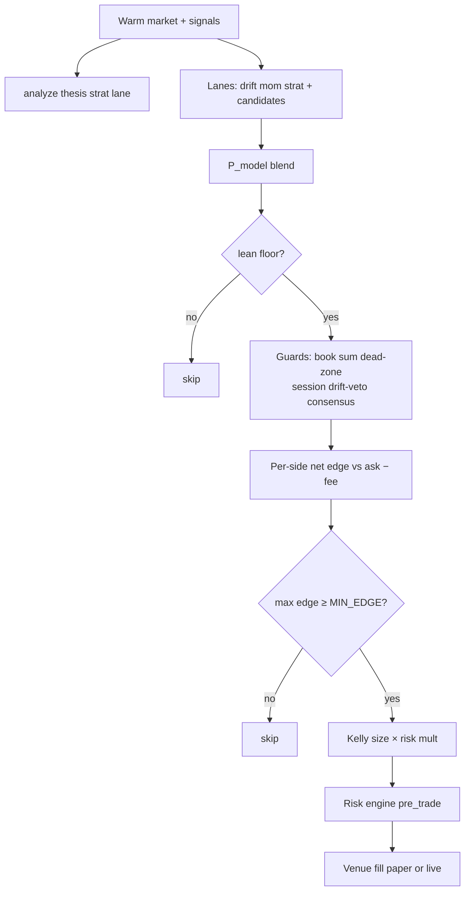

# Strategy design — Polymarket Bot Arena

**Market:** Polymarket recurring series *BTC Up or Down 5m* (Gamma `series_id=10684`).  
**Resolution:** window closes **Up** iff BTC ≥ the price-to-beat at window open (reconstructed from Binance 1m open at `eventStartTime`).  
**Goal:** positive expected value after **taker fees and slippage**, under paper-then-live discipline.

This document is the strategy contract for bots, signals, evolution, and risk. Implementation detail lives in `CLAUDE.md` and `BUG_HISTORY.md`.

---

## 1. Market microstructure facts

| Fact | Implication |
|------|-------------|
| Binary payoff $1 / $0 per share | Kelly `f* = edge / (1 − price)` is the natural size |
| Taker fee peaks near 50¢ (`fee ∝ p(1−p)`) | Mid-priced “coin flips” are expensive; need real edge |
| Books can be wide / gapped | Decide on **ask** for cost; use **mid** for consensus; reject bad book sums |
| 5-minute horizon | Drift vs strike dominates multi-hour swing heuristics |
| Crowd prices are strong | Fighting high consensus (&lt;35¢ underdog) historically catastrophic |

**Key insight:** a signal can be **predictive** (follow-WR ≫ 50%) and still **lose money** once you pay the market price + fee. Live weight requires **net edge**, not accuracy alone.

---

## 2. Decision architecture



### 2.1 Model blend (directional)

```
P_model = 0.5 + 0.5 · Σ_i w_i · x_i     # x_i ∈ [-1, 1], YES-positive
```

Per-strategy weights `w_i` come from `BaseBot.STRATEGY_SIGNAL_PROFILE`, optionally nudged by the **core-lane tuner** and candidate **lane_overrides** (Signal Lab).

| Lane | Role | Default live weight |
|------|------|---------------------|
| **drift** | BTC vs accurate window strike (time-scaled tanh) | Core (highest trust fundamental) |
| **mom** | Short BTC candle momentum | Core |
| **strat** | Strategy `analyze()` thesis | Core, **magnitude capped** (`STRAT_LANE_CONF_CAP` ≈ 0.30) |
| pm / cvd / obi | In-market / flow | Kill-switched 0 until revalidated |
| fut / tech / xasset | Perp meta, technicals, cross-asset | Candidates; promote via Lab only |
| learn | Historical bias buckets | Off (`LEARNING_ENABLED=False`) |

**Trust:** `trust_eff = trust × min(1, |P_model−0.5| / MODEL_CONVICTION_SCALE)` so near-coin-flip models cannot mint large “edge” from market displacement alone.

### 2.2 Side selection

For each side `s ∈ {YES, NO}` with executable ask `a_s`:

```
edge_s = trust_eff · (P_s − a_s) − taker_fee(1, a_s)
```

Buy `argmax edge_s` if that edge clears the strategy’s `MIN_EDGE` (after flow-only tax when |drift| is small). Model must **lean** toward the side (`P_model` on the correct side of 0.5).

### 2.3 Default profiles (emphasis, not direction)

| Strategy | drift / mom / strat | Trust | Notes |
|----------|---------------------|-------|-------|
| momentum | 0.35 / 0.40 / 0.25 | 0.50 | Trend-following analyze() |
| phantom | 0.20 / 0.30 / 0.50 | 0.50 | EMA/breakout thesis-heavy |
| mean_reversion | 0.70 / 0 / 0.30 | 0.60 | Drift-gated fade; max mid ~0.58 |
| hybrid | 0.50 / 0.20 / 0.30 | 0.50 | Meta over sub-bots |
| sentiment | 0.30 / 0 / 0.70 | 0.50 | Flow thesis; not default slate |

Sniper and makers **override** `make_decision` with zone/band logic but share drift-confirmation and many venue guards.

### 2.4 Arbitrage (separate path)

Market-neutral: when depth-walked VWAP(YES)+VWAP(NO) leaves margin after fees, buy **matched shares** on both legs. Not a directional model; evolution-exempt. One-legged fills are failures (naked risk).

---

## 3. Guardrails (must not regress)

These exist because of measured loss modes:

| Guard | Rule of thumb | Failure mode if removed |
|-------|----------------|-------------------------|
| Model lean floor | Skip weak `|P−0.5|` | Noise trades clear MIN_EDGE |
| Book sum | \|YES+NO−1\| ≤ tol | Phantom cross-book edge |
| Consensus / high price | Side mid ∈ [~0.35, ~0.72] | Fight crowd / bad R:R |
| Dead-zone | Skip mid ∈ [0.42,0.58] if \|drift\| small | Largest historical $ leak |
| Drift veto | Don’t fight strong drift | ~26% WR class |
| Mid vs ask | Guards on mid, cost on ask | Wide books bypass consensus |
| Exposure cap | Cap open cost per (market, side) across bots | Correlated 4× pile-in |
| Session skip | Flat at NYSE open/close ET | Flip-heavy windows |
| Flow-only edge tax | Higher bar when drift flat | Noisy flow overtrade |
| Kelly edge cap | Size uses capped edge | Stale-input max bets |

Zone bots (sniper, makers) additionally require **signed drift** toward the chosen side — price pattern alone is not edge.

---

## 4. Sizing

1. Fee-adjusted edge on the chosen ask.  
2. Optional continuous **flow-only tax** on `min_edge` when |drift| is low.  
3. `f* = edge_sized / (1 − price)` with edge **capped** for sizing only.  
4. `bet = KELLY_FRACTION × f* × bankroll` (dashboard-editable fraction).  
5. Shares-first (`amount = shares × price`); floor to venue min shares.  
6. Risk engine may multiply size or block.  
7. Shared pool: cannot spend cash the paper pool lacks; live uses wallet + `LIVE_MAX_POSITION`.

Paper: one shared virtual pool (default bankroll $200, Settings top-up).  
Live: hard per-trade and daily loss caps in `config.py`.

---

## 5. Regimes

`regime_detector` emits continuous labels used as **context**:

- **high_vol_trend / low_vol_trend** — allow trend-oriented emphasis  
- **high_vol_chop** — damp mom/strat; hybrid shifts toward fade book  
- **low_vol_range** — quieter tape; mom quiet-regime damp  

Hybrid’s online meta-learner keeps **per-regime-bucket** multipliers so “phantom works in trends, fails in chop” can be learned without averaging to zero.

Evolution fitness includes **regime robustness** so a bot that only wins in one micro-regime is not over-promoted.

---

## 6. Evolution (GA) vs signal tuning

| System | Owns | Does not own |
|--------|------|--------------|
| **GA** (`evolution/`) | Which bot instances / params survive | Lane weights |
| **Core-lane tuner** | drift/mom/strat weights per strategy_type | Bot roster |
| **Lane promoter/monitor** | Candidate fut/tech/xasset on/off | Strategy params |

**Survival (directional):** enough trades in the 24h window; survive if window P&L &gt; 0 **or** break-even gap ≥ `EVOLUTION_BE_GAP_MIN` (~3¢). Elites protected. Offspring: tournament → blend crossover → modest mutation.

**Exempt:** arbitrage, makers, copy-trade.

---

## 7. Signal promotion pipeline

1. **Offline harness** — resolved markets + Binance + PM history → follow-WR, IC, net EV after fee (+ optional slippage).  
2. **Nominate** — `--propose` if n, WR, net edge clear bars.  
3. **Live shadow** — `cand(...)` in trade reasoning at weight 0.  
4. **Approve** — human or auto if live accuracy clears hysteresis bar.  
5. **Monitor** — auto-demote if live accuracy decays.  

Never promote on harness alone. Empirical lesson: harness “tech” ~75% → live ~52% → demoted.

Expanded pure features (multiscale, microstructure, flow, session, regime context) stay at weight 0 until the same pipeline promotes them. See `docs/signal-suite.md`.

---

## 8. Risk engine

Central `arena/risk_engine.py`:

- Per-bot / portfolio daily loss floors (paper defaults stricter than legacy “uncapped”)  
- Max drawdown → size taper then pause  
- Underperformance pause (window P&L)  
- Optional historical VaR  
- Kill switch (dashboard / state / flag file)  

Risk is **orthogonal** to strategy edge: a good edge with unbounded correlation still needs portfolio caps.

---

## 9. Backtest contract

Backtests must call the **same** `make_decision` path as paper/live. Acceptable approximations:

- Synthetic ask ladder from historical mid  
- Fixed or compounding bankroll flag  
- No arb/maker (missing historical depth for two-sided microstructure)

Unacceptable: reimplementing edge math only in the backtester; training on future windows without walk-forward.

---

## 10. Strategy-specific notes

### Momentum
Rides short BTC impulse + mom lane. Vulnerable in chop → regime damp. Needs drift agreement on strong moves.

### Phantom
EMA 9/26 + breakout (warmup ~36 candles). Thesis-heavy; strat cap limits overconfident analyze().

### Mean reversion
**Not** classic fade-the-move against drift. Drift picks the side; z-score times pullbacks **with** drift (`min_drift`). Max side mid ~0.58 (“market lags” harness rule). Ungated meanrev historically 0/11.

### Hybrid
Ensemble of sub-analyzers with regime tilt × live WR tilt × online meta weights. Best as a **portfolio diversifier**, not a free lunch.

### Sniper
Price zones only with **min_drift** confirmation. Early-window size boosts removed (BUG #24).

### Makers
Quote bands + drift; currently execute as **taker** fills (limit posting not yet first-class). Evolution-exempt; judged on their own P&L, not GA.

### Arbitrage
Depth VWAP + share match. Edge is mechanical; inventory risk is incomplete fill.

---

## 11. Anti-patterns (do not reintroduce)

1. Additive fair value (`mid + tilt + alpha`) — invents edge by construction.  
2. Mid-priced decisions with ask-priced fills — systematic slippage rejects / bad fills.  
3. Wrong strike (first sighting mid-window) — destroys drift.  
4. Flat WR threshold (e.g. 65%) for evolution — expensive winners die, cheap losers live.  
5. Promoting lanes on follow-WR without net edge or live shadow.  
6. Disabling dead-zone / exposure cap “to get more trades.”  
7. Full-Kelly or uncapped live size before paper stability.  
8. Learning bias in the blend while inverted / uncalibrated.

---

## 12. Success metrics

| Horizon | Paper success | Live success |
|---------|---------------|--------------|
| Trade | Positive fee-aware EV, sane skip mix | Fill within slippage band |
| Day | Pool P&L; gap ≥ ~3–5¢ on active bots | Same after costs |
| Week | Survives evolution without thrash; no risk pause storm | Tracks paper within expected slip |
| Month | Stable lane set; harness rank still agrees with live monitor | Bankroll up after all fees |

**Break-even gap:** `win_rate − average_entry_price`. High WR at high entry still loses.

---

## 13. Change control

Any change to guards, fees, strike, Kelly, or lane weights should ship with:

1. Unit/integration tests for the regression class (see `tests/`).  
2. Offline harness or backtest comparison when the decision surface moves.  
3. Paper soak before live.  
4. BUG_HISTORY note if it fixes a named loss mode.

When in doubt: **skip** is the default action.
